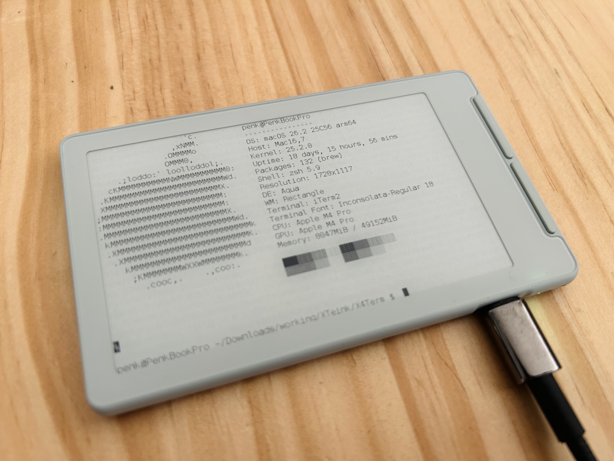

# X4Term



A pocket e-ink VT100 terminal for the [Xteink X4](https://www.xteink.com/products/xteink-x4).

78 columns x 24 rows on an 800x480 e-ink display, connected via USB serial. 

## Features

- **VT100/ANSI escape sequences** - cursor movement, erase, scroll regions, insert/delete lines and characters, SGR attributes
- **Alternate screen buffer** - estore the previous screen on exit (`CSI ?1049h/l`)
- **256-color & RGB** - mapped to grayscale luminance with Bayer dithering 
- **UTF-8** - full BMP decode (U+0000-U+FFFF)
- **Extended Unicode glyphs**:
  - Latin-1 Supplement (pre-rendered from DejaVu Sans Mono)
  - Box drawing, block elements, quadrant blocks (algorithmic)
  - Braille patterns (algorithmic, 256 patterns)
  - Arrows, typographic punctuation, geometric shapes
- **E-ink optimized rendering** - partial updates for small changes, periodic full refresh to clear ghosting

## Hardware

- Xteink X4 (ESP32-C3, 800x480 e-ink)
- USB-C connection (CDC serial)

## Build

Requires [PlatformIO](https://platformio.org/) and the [open-x4-sdk](https://github.com/open-x4-epaper/community-sdk) (included as a git submodule).

```
git clone --recursive https://github.com/penk/X4Term.git
cd X4Term
pio run            # build
pio run -t upload  # flash
```

If you already cloned without `--recursive`:

```
git submodule update --init --recursive
```

## Usage

Connect via USB and attach a serial terminal:

```
stty rows 24 cols 78
TERM=xterm-256color COLUMNS=78 LINES=24 script -q /dev/cu.usbmodem2101
```

## Font Generation

The 10x20 bitmap font is generated from [DejaVu Sans Mono](https://dejavu-fonts.github.io/) (included in `fonts/`):

```
python3 -m venv .venv && source .venv/bin/activate && pip install Pillow
python3 scripts/generate_term_font.py
python3 scripts/generate_term_font.py --ext-ranges 00A0-00FF,2010-2027,2190-2199
```

## Project Structure

```
src/main.cpp              - Entry point, serial/button handling, render loop
lib/VtParser/             - VT100/ANSI escape sequence parser, UTF-8 decoder
lib/TermBuffer/           - Terminal cell grid, cursor, scroll, alt screen buffer
lib/TermRenderer/         - E-ink framebuffer rendering with Bayer dithering
lib/TermFont/             - Bitmap font (ASCII + extended Unicode)
scripts/                  - Font generation and test scripts
```
